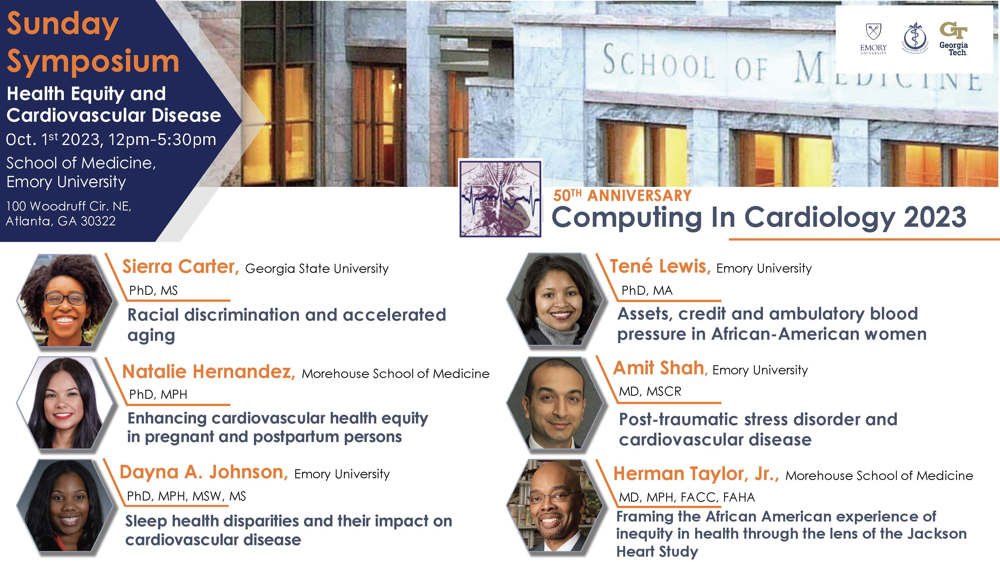

## Sunday Symposium
The Sunday Symposium will address **health equity with a cardiovascular spin**.

1. When: Sunday, October 1st, 2023 at 12pm-5:30pm
2. Where: [James B. Williams Medical Education Building](https://www.med.emory.edu/about/location/directions/index.html){: target="_blank"}, School of Medicine, Emory University
3. Address: [100 Woodruff Circle Atlanta, GA 30322](https://goo.gl/maps/s3ojFmzesXYqnWjG7){: target="_blank"}
4. Transportation: 
* **CinC 2023 designated bus:** Transportation designated for the CinC 2023 Sunday Symposium will be provided to all conference attendees for the entire day. On the Emory [TransLoc.com](https://emory.transloc.com/m/){: target="_blank"} site or [TransLoc app](https://emory.transloc.com/info/mobile){: target="_blank"} you will find a dedicated CinC 2023 vehicle to select. This feature offers real-time location tracking and a concise map of the route for transportation to the Sunday Symposium venue.
* **Public transportation:** MARTA bus #36 is a public transportation system that connects Atlanta Midtown and Emory University. The bus departs from Midtown Station every 40 minutes.\
Getting on MARTA 36: Midtown Station\
Getting off MARTA 36: N Decatur Rd NE & Clifton Rd\
MARTA 36 [bus route](https://www.itsmarta.com/pdfs/maps/36.pdf) and [schedule](https://www.itsmarta.com/36.aspx)

## Sunday evening reception
The reception will be ready at the Michael C. Carlos Museum on the Emory University campus, 10 minutes walk from the Sunday Symposium venue, James B. Williams Medical Education Building (map below). 
1. When: Sunday, October 1st, 2023 at 6:30pm-8:30pm
2. Where: [Michael C. Carlos Museum](https://carlos.emory.edu/){: target="_blank"} on the Emory University campus
3. Address: [571 South Kilgo Circle Atlanta, GA 30322](https://goo.gl/maps/199kRV6W3es9JHre7){: target="_blank"}
4. Transportation: Transportation designated for the CinC 2023 Sunday Symposium will be provided to all conference attendees for the entire day. On the Emory [TransLoc.com](https://emory.transloc.com/m/){: target="_blank"} site or [TransLoc app](https://emory.transloc.com/info/mobile){: target="_blank"} you will find a dedicated CinC 2023 vehicle to select. This feature offers real-time location tracking and a concise map of the route for transportation to the evening reception venue.

<iframe src="https://www.google.com/maps/embed?pb=!1m28!1m12!1m3!1d3315.796693094433!2d-84.32455306346273!3d33.791747926092995!2m3!1f0!2f0!3f0!3m2!1i1024!2i768!4f13.1!4m13!3e2!4m5!1s0x88f506fa05920093%3A0x262d6790fb6fd912!2sEmory%20University%20School%20of%20Medicine%20GME%20Office%2C%20100%20Woodruff%20Cir%2C%20Atlanta%2C%20GA%2030322!3m2!1d33.7939071!2d-84.32166289999999!4m5!1s0x88f506f030d8c67f%3A0xe19cbc6584c08754!2sMichael%20C.%20Carlos%20Museum%2C%20571%20South%20Kilgo%20Cir%20NE%2C%20Atlanta%2C%20GA%2030322!3m2!1d33.790344999999995!2d-84.3243433!5e0!3m2!1sen!2sus!4v1684856622777!5m2!1sen!2sus" width="600" height="450" style="border:0;" allowfullscreen="" loading="lazy" referrerpolicy="no-referrer-when-downgrade"></iframe>

[Top of Page](#top){: .btn}

---

[Calendar](../dates/) &#9632; [Authors](../authors) &#9632; [Programme](../programme/) &#9632; [Travel Info](../travel/) &#9632; [Maps](../map) &#9632; [Sponsors](../sponsors/) &#9632; [PhysioNet Challenge](../challenge/) &#9632; [FAQ](../faq/) &#9632; [Contacts](../contact/)